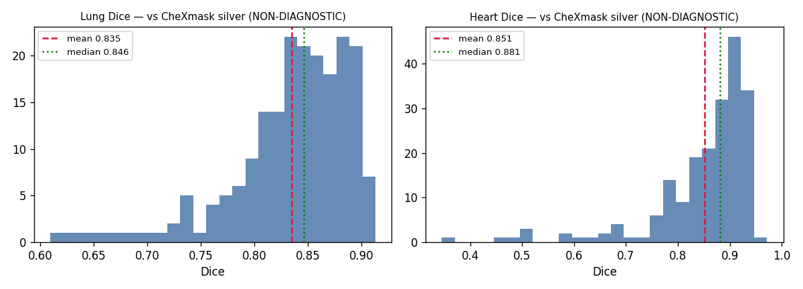
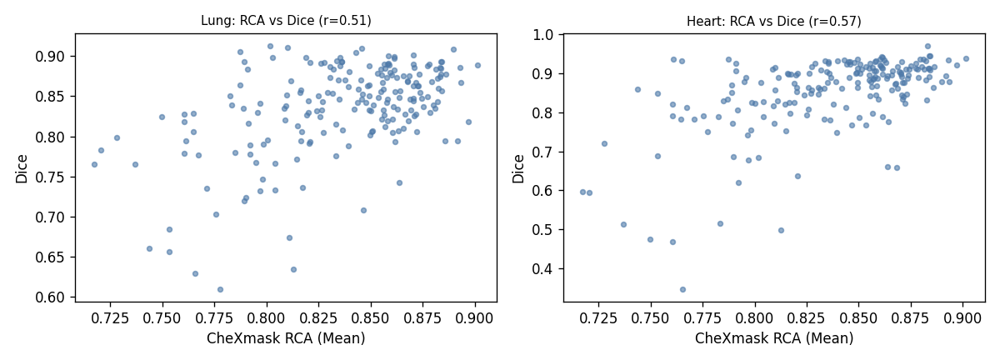
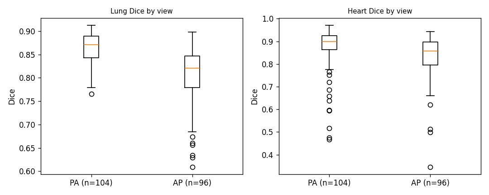
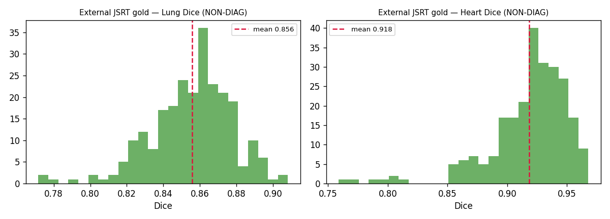
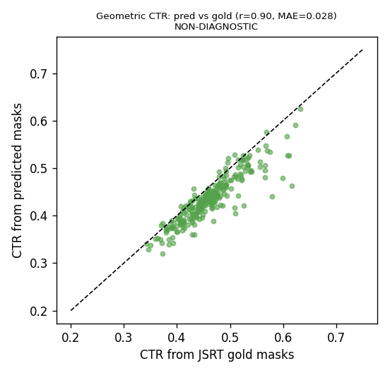
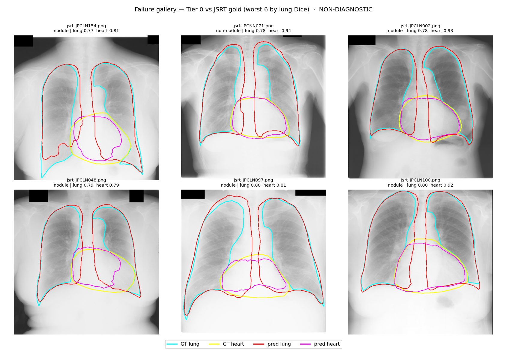

# CXR-Seg — Evaluation Report (M1 internal baseline + M2 external validation)

> Covers: internal Tier-0 baseline vs CheXmask silver (M1) and external validation
> vs JSRT gold + CTR (M2). Living document; failure gallery + 2nd external source pending.

## M1 — Tier 0 Zero-Training Baseline (internal, vs CheXmask silver)

> **⚠️ NON-DIAGNOSTIC — research/teaching demo.** Numbers below measure **agreement
> with CheXmask silver labels** (HybridGNet-generated), **not clinical accuracy.**
> See `DISCLAIMER.md`.

## Setup

- **Model (Tier 0, zero training):** TorchXRayVision anatomical segmentation (PSPNet, trained on ChestX-Det). Automatic, CPU.
- **Reference:** CheXmask **v0.4** (CC BY 4.0) silver masks, filtered to **Dice RCA (Mean) ≥ 0.7** (official recommendation).
- **Split:** NIH ChestX-ray14, **patient-level** test set (no patient leakage; regression-tested), seed 42.
- **Sample:** n = 200 images (CPU, ~20 min).
- **Metrics:** Dice & IoU on **lung (left∪right union)** and **heart**; per-image, aggregated with **1000× bootstrap 95% CI**. (Union avoids left/right naming differences between the two models.)
- **Independence:** TorchXRayVision (ChestX-Det) vs CheXmask (HybridGNet) are source-independent → evaluation is not circular.

## Results (Tier 0 vs CheXmask silver)

| Structure | Dice (mean) | Dice 95% CI | IoU (mean) | IoU 95% CI |
|---|---|---|---|---|
| Lung (union) | **0.835** | [0.826, 0.843] | 0.720 | [0.708, 0.731] |
| Heart | **0.851** | [0.837, 0.865] | 0.752 | [0.732, 0.770] |

## Distribution & quality analysis (from tier0_results.csv, n=200)

- **Left-skewed, not uniform failure.** Median > mean for both (lung 0.846 vs 0.835; heart **0.881** vs 0.851): most cases agree well, a minority hard tail pulls the mean down. **~80%** of cases reach Dice ≥ 0.8 for both structures.
- **Failures are a small tail.** Below Dice 0.7: lung 3.5%, heart 8.0%. Below 0.5: lung 0%, heart 2%.
- **RCA predicts agreement (key finding).** Correlation between CheXmask's own quality score (RCA Mean) and our Dice is **+0.51 (lung)** and **+0.57 (heart)**. i.e. **where the silver label is itself lower-confidence, our model agrees less** — so many "low Dice" cases are as much about silver-label uncertainty as model error. This both (a) validates RCA as a meaningful signal and (b) reinforces the silver-not-gold caveat.

## Subgroup by view (fairness)

| View | n | Lung Dice | Heart Dice |
|---|---|---|---|
| PA | 104 | 0.863 | 0.868 |
| AP | 96 | 0.804 | 0.833 |
| **Gap (PA−AP)** | | **+0.059** | **+0.035** |

**AP is consistently worse** than PA for both structures — expected, since AP/portable films are typically sicker/ICU patients with more rotation, magnification, and airspace disease. This is a genuine performance-disparity disclosure, not something to hide.

## Failure-gallery candidates (worst 5 by lung Dice — all AP)

| Image | View | RCA(Mean) | Lung Dice | Heart Dice |
|---|---|---|---|---|
| 00008911_020.png | AP | 0.765 | 0.629 | **0.346** |
| 00012628_048.png | AP | 0.778 | 0.609 | 0.750 |
| 00022815_043.png | AP | 0.813 | 0.634 | 0.498 |
| 00025691_006.png | AP | 0.753 | 0.657 | 0.849 |
| 00009600_023.png | AP | 0.744 | 0.660 | 0.660* |

*heart values vary widely on failures → lung and heart failures are partly independent. → M2 renders these as the failure gallery.

## Honest interpretation (limitations)

1. **Silver, not gold.** The reference is model-generated (HybridGNet). Dice here = agreement between two independent models, **not** correctness against expert masks. Gold anchoring comes in **M2 via JSRT (human)**.
2. **Convention gap explains part of the lung score.** CheXmask lungs are smooth landmark-contour fills (tend to include the full anatomical field even under opacity); TorchXRayVision is pixel-wise and clips at visible lucency. So lung Dice ~0.835 partly reflects **different segmentation conventions**, not pure error.
3. **Single hard cases are not the headline.** A single AP consolidation case scored lung 0.755 / heart 0.712; the n=200 mean is the representative number.
4. **Boundary metric pending.** Hausdorff distance (SPEC §6.1) not yet computed — to add for boundary quality.

---

# M2 — External Validation on JSRT gold (human) + CTR

> **The strongest credibility action.** JSRT is independent of TorchXRayVision's
> training data (ChestX-Det/NIH), and its SCR masks are **human gold** — so this
> is our most trustworthy accuracy estimate, not model-vs-model agreement.

## Setup
- **External set:** JSRT (n=246; 153 nodule `JPCLN`, 93 non-nodule `JPCNN`), 512×512, PA.
- **Gold masks:** SCR (van Ginneken) left lung / right lung / heart, via `meyupy/chest-x-ray-segmentation-jsrt-and-padchest`. Class mapping auto-detected + visually confirmed.
- **Model:** same Tier 0 TorchXRayVision, zero training. Evaluated at native 512.

## Results (vs JSRT gold)

| Structure | Dice (mean) | Dice 95% CI | median | min | IoU |
|---|---|---|---|---|---|
| Lung (union) | **0.856** | [0.853, 0.858] | 0.859 | 0.772 | 0.748 |
| Heart | **0.918** | [0.915, 0.923] | 0.925 | 0.759 | 0.851 |

**High floor, no catastrophic failures** (worst lung 0.772, worst heart 0.759).

## Internal (silver) vs External (gold) — honest side-by-side

| Structure | Internal silver @NIH | External gold @JSRT | Δ |
|---|---|---|---|
| Lung | 0.835 | 0.856 | **+0.021** |
| Heart | 0.851 | 0.918 | **+0.067** |

**Interpretation (important — do not over-claim):**
1. **No external collapse** — unlike the typical medical-AI story. Against gold human masks the model is strong (heart 0.918).
2. **But the +Δ is NOT a generalization gain.** Two things changed at once: the **reference standard** (silver→gold; CheXmask's contour-fill penalized the pixel-wise model) **and the domain** (messy NIH → clean JSRT). It mainly says the internal silver score *understated* true accuracy.
3. **JSRT is a "friendly" external set** (clean PA, single scanner, mostly non-ICU). Harder domains would likely be lower — see the internal **AP subgroup (lung 0.804 ≪ PA 0.863)**. A second, harder external source (Montgomery+Shenzhen, or portable-AP) is the honest next check.

## Subgroup: nodule vs non-nodule

| Group | n | Lung Dice | Heart Dice |
|---|---|---|---|
| Nodule (JPCLN) | 153 | 0.858 | 0.918 |
| Non-nodule (JPCNN) | 93 | 0.851 | 0.919 |

**Nodule presence does not degrade anatomical segmentation** (identical within noise) — expected, since nodules are small and don't move lung/heart boundaries.

## CTR validation (geometric, NON-diagnostic)

Geometric CTR from **predicted** masks vs from **gold** masks (n=246):

- **MAE 0.028**, **Pearson r 0.90**; gold CTR mean 0.462, predicted mean 0.436 → small **systematic under-estimate (−0.026)** (model draws slightly smaller heart/thorax).
- 21% of JSRT gold have CTR > 0.5.

The CTR *pipeline* tracks the gold-derived CTR closely, but this validates **geometric consistency**, not clinical CTR — still non-diagnostic.

## Failure gallery (worst 6 by lung Dice, vs JSRT gold)

*Contours: cyan = GT lung, red = pred lung, yellow = GT heart, magenta = pred heart.*

**The failures are systematic, not random — they concentrate at two of the hardest anatomical boundaries:**

1. **Retrocardiac / mediastinal lung border.** The SCR gold contour includes lung tissue *behind the heart* and up to the mediastinal line; Tier-0 tends to **stop at the visible heart border**, excluding retrocardiac lung (e.g. JPCNN071, JPCLN002, JPCLN100 — over/under-seg centred "mid-center").
2. **Costophrenic angle / lung base.** Gold extends deep into the costophrenic recesses; Tier-0 **clips the base higher** (e.g. JPCLN154, JPCLN097 — under-seg "lower-center").

Auto-observed disagreement locations:

| Image | group | lung | heart | under-seg (GT-only) | over-seg (pred-only) |
|---|---|---|---|---|---|
| JPCLN154 | nodule | 0.77 | 0.81 | lower-center | lower-center |
| JPCNN071 | non-nodule | 0.78 | 0.94 | mid-center | mid-center |
| JPCLN002 | nodule | 0.78 | 0.93 | upper-left | mid-center |
| JPCLN048 | nodule | 0.79 | 0.79 | mid-left | mid-right |
| JPCLN097 | nodule | 0.80 | 0.81 | lower-center | mid-center |
| JPCLN100 | nodule | 0.80 | 0.92 | upper-right | mid-center |

**Notes (honest):**
- Heart contours mostly agree even in the worst lung cases (heart Dice up to 0.94); predicted heart is slightly smaller/higher — consistent with the CTR **−0.026** under-estimate.
- These are the **score tail**: even the worst lung Dice ≥ 0.77.
- 5/6 are nodule (`JPCLN`) images, but this is tail sampling, not a nodule effect (subgroup means are identical). The real driver is **boundary definition** at retrocardiac/costophrenic regions.
- **How you'd close it:** Tier-1 fine-tuning or post-processing to extend into retrocardiac/costophrenic regions — documented, not hidden.

## Reproducibility

- Internal: `notebooks/kaggle_cell_m1_baseline.py` → `tier0_results.csv`.
- External: `notebooks/kaggle_cell_m2_external_jsrt.py` → `jsrt_external_results.csv`.
- Failure gallery: `notebooks/kaggle_cell_m2_failure_gallery.py` → `failure_gallery.png`.
- All: Internet ON; optional GPU T4.
